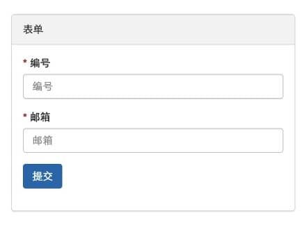

# Laravel Lego, Save you from CRUD.

## Demo

- <http://lego.zhw.in>


## Usage


- UserController.php

```php
$form = Lego::form(new User());

$form->addText('number', '编号')->required()->rule('numeric')->unique();
$form->addText('email', '邮箱')->required()->rule('email')->unique();

return $form->view('layout', ['form' => $form]);
```

- layout.blade.php

```html
<!doctype html>
<html lang="en">
<head>
    @include('lego::styles')
</head>
<body>

    {!! $form !!}

    @include('lego::scripts')
</body>
</html>
```

- Just works!




## Install

### 1、Dependency

```bash
composer require "wutongwan/lego"
```

### 2、Publish lego assets

```bash
php artisan vendor:publish --tag=lego-assets --force
```

> **Tips:**
> 
> Add this command to `post-update-cmd`, In order to update lego static files Automatically.


## Documents

- [Form 表单](./form.md)
- [Fields 支持的输入类型](./fields.md)
- [Filter 筛选器](./filter.md) 
  - [Filter 输出筛选条件](./filter-outgoing.md)
- [Grid - 列表页](./grid.md)
- [Register - 注册器](./register.md)
- [Button 按钮](./button.md)
- [Confirm 确认操作](./confirm.md)
- [API Documents](http://zhangweide.cn/laravel-lego-api-doc/)
