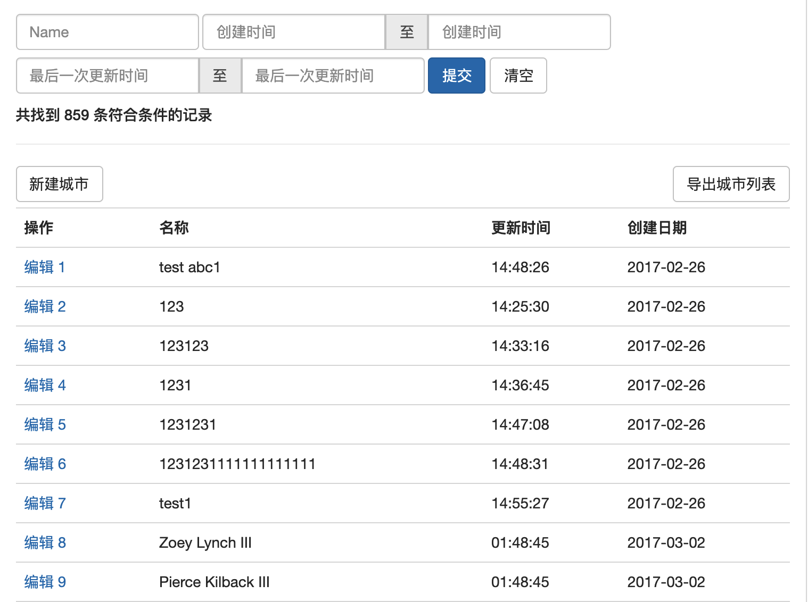
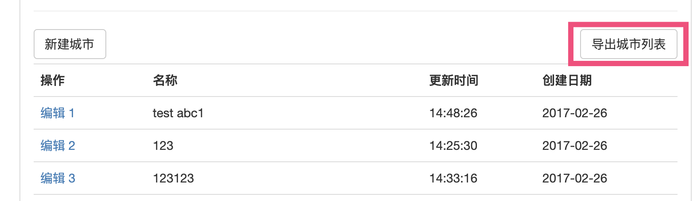

# Grid

Grid 用于生成列表页面，在保证简单接口的前提下，一如既往的强大。

* TOC
{:toc}




## Basic

```php
$grid = \Lego::grid($query);

$grid->add('id', 'ID'));
$grid->add('summary', '摘要');
$grid->add('billing_date|date', '账单日');
$grid->add('fen|fen2yuan', '金额（元）');
$grid->add('receiver.name', '接收人');
$grid->add('paid_at', '付款时间');
$grid->add('created_at', '创建时间');
$grid->paginate(100)->orderBy('id', true); // order by id desc

return $grid->view('view-file', compact('filter', 'grid'));
```

### insert to special location

```php
$grid->after('id')->add('column', 'Description');
```

### remove

```php
$grid->remove('id');
$grid->remove('paid_at', 'created_at');
$grid->remove(['paid_at', 'created_at']);
```

### set default value

```php
$grid->add('column', 'Description')->default('default value');
```

### add button

```php
$grid->addLeftTopButton('new', route('...'));
```

## Responsive view

Responsive view is enabled by default, you can disabled it in config file `lego.php`,  
In addition , you can call `responsive()` method to enable it for current instance.

- Disable Responsive view Globally
```php
[
    'widgets' => [
        'grid' => [
            'responsive' => false,
        ]
    ]
]
```

- Enable responsive view for current `$grid` instance
```php
$grid->responsive();
```

## Pipe

管道，可以通过管道单元格的原始值进行二次处理，lego 内置了一些常用管道，例如字符串截断、日期格式等，同时也支持传入自定义的 Closure ，可用于进行更复杂的处理。

pipe 有两种调用方式

1、使用管道符号 `|`

  ```php
  $grid->add('name|trim|strip', 'Name');  
  ```

2、调用 `pipe()` 方法

  ```php
  $grid->add('name')->pipe('trim')
  ```

### Available pipes

- trim

    ```php
    $grid->add('name|trim', 'Name');
    ```

- strip, remove html tags

    ```php
    $grid->add('name|strip', 'Name');
    ```

- limit, truncates value at the specified length:

    ```php
    $grid->add('longText|limit:100');
    ```


- date, convert to date string

    ```php
    $grid->add('published_at|date', 'Published Date');
    // eg: 2017-01-01 12:00:01 => 2017-01-01
    ```

- time, convert to time string

    ```php
    $grid->add('updated_at|time', 'Last Moidify Time');
    // eg: 2017-01-01 12:00:01 => 12:00:01
    ```

### Closure Pipe

传入 pipe() 的 Closure 最多支持接收三个参数：

- $value 当前值
- \$model 当前行对应的 \$model  
- $cell Lego 内部的单元格对象

```php
$grid->add('name', 'Name')

    ->pipe(function ($name) {
        return strtoupper($name);
    })

    ->pipe(function ($name, City $city) {
        /**
        * $city is the model of current row
        */
        return $name . '(' . $city->name .')';
    })

    ->pipe(function ($name, City $city, Cell $cell) {
        /**
        * $cell is instanceof \Lego\Widget\Grid\Cell
        * 
        * $cell->name() === 'name'; // Important: NO pipe name
        * $cell->description() === 'Name';
        * $cell->getOriginalValue();
        */
        return $name;
    });

```

### Self-Defined Pipe

使用者可以继承 `\Lego\Widget\Grid\Pipes` 实现自己的 Pipes ，然后将其注册到 lego 的配置文件的 `widgets.grid.pipes` 数组中，这样在 Grid 就可以使用 `|` 引入 pipe。

下面示例创建了一个用于翻译的 pipes 类，其中所有以 `handle` 开头的成员函数将会被识别为可以直接使用的 pipe

`\Lego\Widget\Grid\Pipes` 有三个成员函数，用于获取管道需要的数据：

- `value()` 输入 `pipe` 的值，例如下面的 `handleUpper`
- `data()` 这一行对应的原始数据，如果数据源是 Laravel Model ，此函数返回值为 Model 实例
- `cell()` 返回 `\Lego\Widget\Grid\Cell` 实例，当前单元格的描述、对应的数据库字段，都可以通过此实例获取


```php
class Pipes extends \Lego\Widget\Grid\Pipes
{
    pubilc function handleUpper()
    {
        return strtoupper($this->value());
    }

    public function handleTrans2en()
    {
        return $this->data()->getAttribute(
            $this->cell()->name() . 'en'
        );
    }
}
```

```php
$grid->add('name|trans2en', 'Name');
```

## Tag

给特定列按内容添加标签，例如用在状态列，方便根据颜色快速定位数据行。

```php
$grid->add('status', 'Status')
    ->tag([
        'enable' => TagStyles::SUCCESS,
        'disable' => TagStyles::DANGER,
        '*' => TagStyles::DEFAULT,
    ])
```

效果如图:


## format()

对当前单元格的值进行简单的拼接或包装。有些时候我们需要在一列中显示由多个属性组成的内容，在此之前我们可以使用 Pipe + Closure 实现，现在可以使用更简单的 format 实现。


```php
$grid->add('name', 'Name')
    ->format('{name} ({gender})'); // 示例显示: 张三 (男)
```

相当于:

```php
$grid->add('name', 'Name')
    ->pipe(function ($_, $model) {
        return sprintf('%s (%s)', $model->name, $model->gender);
    });
```

format 中也支持读取 Relation 的值

```php
->foramt('{name} {country.name}')
```


## link()

给当前单元格内容添加链接。link() 的第一个参数会使用 format() 同样方式进行解析，即可以在链接中使用属性占位符。

```php
$grid->add('id', 'Edit')
    ->link('https://example.com/edit/{id}');
```

same as

```php
$grid->add('id', 'Edit')
    ->pipe(function ($id, $model) {
        return sprintf(
            '<a href="%s" target="_blank">%s</a>',
            'https://example.com/edit/' . $id,
            $id
        );
    });
```


## Export as Excel (.xls)

### Simple

```php
$grid->export('filename');
```

如上调用后，会在表格左上角添加一个导出按钮:



### Exporting callback

```php
$grid->export('filename', function (Grid $grid) {
    $grid->paginate(1000); // export more
})
```


## 批处理操作

### 一键批处理

```php
$grid->addBatch('批量删除')
    ->each(function (Advance $advance) {
        $advance->delete();
    });
```

```php
$grid->addBatch('汇总')
    ->handle(function (Collection $advances) {
        return Lego::message('共 ' . $advances->sum('amount') . ' 元');
    });
```

### 带确认信息的批处理
```php
$grid->addBatch('批量删除')
    ->message('确认删除？')
    ->each(function (Advance $advance) {
        $advance->delete();
    });
```

### 带动态确认信息的批处理
```php
$grid->addBatch('批量删除')
    ->message(function (Collection $advances) {
        return "确认删除 {$advances->count()} 条记录？"
    })
    ->each(function (Advance $advance) {
        $advance->delete();
    });
```

### 带表单的批处理

```php
$grid->addBatch('变更状态')
    ->form(function (Form $form) {
        $form->addSelect('status')->values('已付款', '作废')->required();
    })
    ->action(function (Advance $advance, Form $form) {
        $advance->status = $form->field('status')->getNewValue();
        $advance->save();
    });
```


> **Tips: 在新 tab、新窗口发起批处理**
>
> ```php
> $grid->addBatch(...)->openInNewTab();
> $grid->addBatch(...)->openInPopup($width = ..., $height = ...);
> $grid->addBatch(...)->resetOpenTarget()
```
